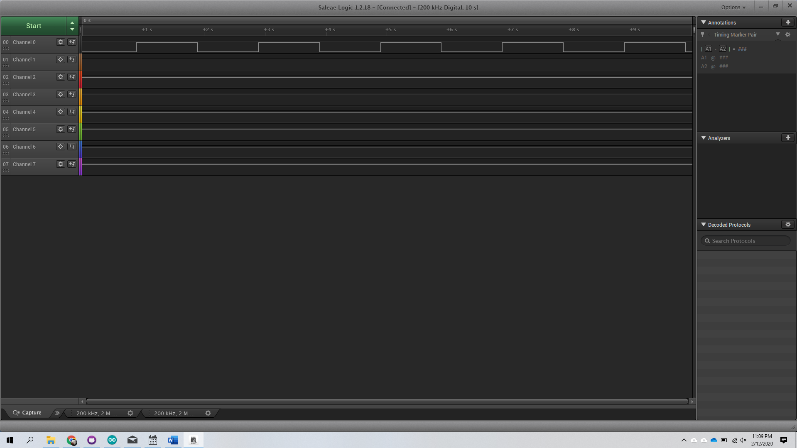
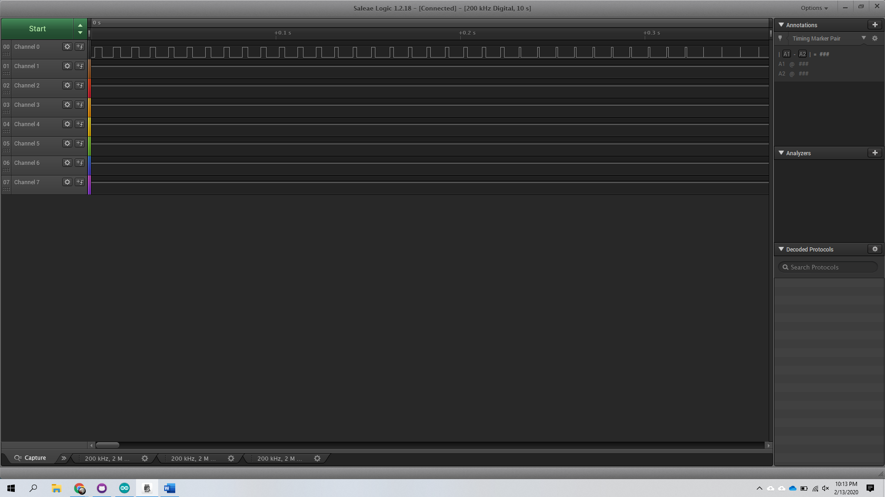
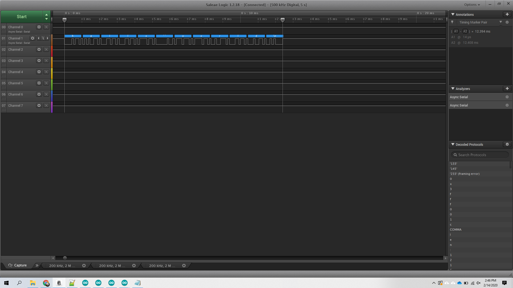
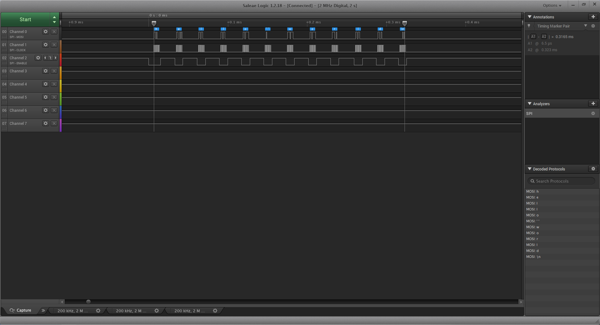

Name: Kevin Kelly

EID: kwk535

Team Number: F1

## Questions

1. Why does your program need a setup and a loop?

    To initialize variables and to have constant tests and checks.

2. What is the downside to putting all your code in a loop?

    It wastes execution time, power and resources.

3. Why does your code need to be compiled?

    So that it can be understood by the hardware level of the machine.

4. When lowering the frequency in procedure A, step 4, what is going wrong? Brainstorm some solutions. Dimmers exist in the real world. What is their solution?

    The LED flickers rather than dims. The account for this issue by adjusting the duty cycle.

5. Why do you need to connect the logic analyzer ground to the ESP32 ground?

    To complete the circuit.

6. What is the difference between synchronous and asynchronous communication?

    Synchronous and asynchronous are the transfer of info except synchronous requires info between two parties at the same time while asynchronous does not.

7. Profile of UART: Sent X bytes in Y time 

    11 Bytes in 12.394ms

8. Profile of SPI: Sent X bytes in Y time

    11 Bytes in 0.3165ms

9. Why is SPI so much faster than UART?

    SPI is faster since it is synchronous and sends data immediately unlike UART being asynchronous

10. list one pro and one con of UART

    PRO: less wirds
	CON: slower

11. list one pro and one con of SPI

    PRO: faster
	CON: more wires

12. list one pro and one con of I2C

    PRO: multiple connections
	CON: I2C requires extra resistors

13. Why does I2C need external resistors to work?

    The wires are open drain and require pull-up or pull-down resistors.
## Screenshots

Procedure A, step 1:

Procedure A, step 4:

Procedure B, UART:

Procedure B, SPI:

